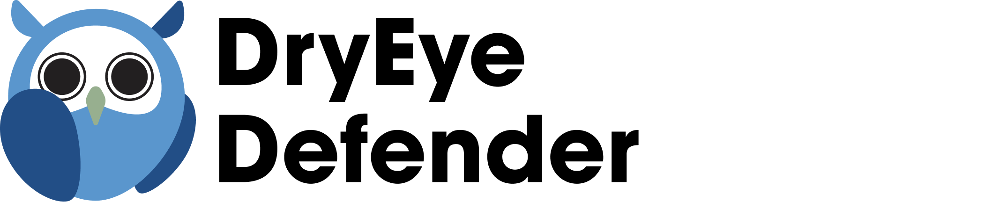
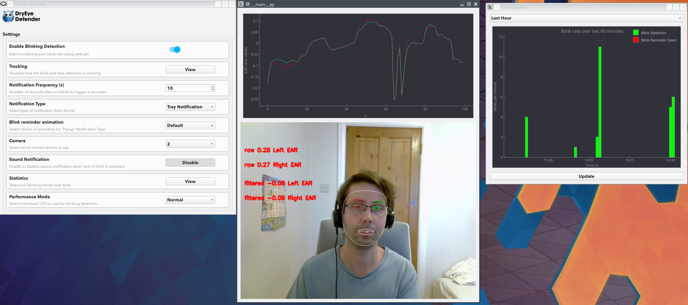
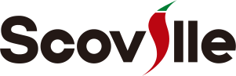

# DryEye Defender 👁️

Protect your eye health with smart blink detection and reminders. DryEye Defender is an open-source application that helps prevent digital eye strain and dry eye syndrome.

## How does it work?

DryEye Defender takes advantage of the latest advancements in Computer Vision and AI to analyse your face for the eyelid position and uses that to measure the extent of your blink over time. If it detects blinks have not occurred for a sufficient duration (configurable by you), you’ll be notified by a system tray notification, a sound notification, or a blink animation - you can personalise the best notification method for you.

## ✨ Key Features

- 🎯 **Real-time Blink Detection**: Advanced facial keypoint tracking using MediaPipe for accurate blink detection
- 📊 **Personal Analytics**: Track your blink rate over time with detailed statistics and visualizations
- 🔔 **Smart Reminders**: Customizable notifications when you're not blinking enough
- 🔒 **Privacy First**: All processing happens locally - no data leaves your device
- 💻 **Cross Platform**: Supports Windows, macOS, and Linux
- 📱 **System Tray Integration**: Runs quietly in the background while protecting your eyes

## 🔬 Science Behind DryEye Defender

- 🔊 Sound Design: Our notification tone (800Hz, 190ms) is scientifically calibrated to optimize blink response [[1](https://link.springer.com/article/10.1007/s00347-004-1072-7)]

- 👁️ Visual Reminders: Animated blink reminders have been proven to increase blink rates by up to 139% in clinical studies [[2](http://www.blinknow.co.uk/index.php?act=viewDoc&docId=11)][[3](https://pubmed.ncbi.nlm.nih.gov/26164310/)]

- ⚖️ Validated Fairness: Our facial detection models are tested across faces from 17 regions [[4](https://drive.google.com/file/d/1QvwWNfFoweGVjsXF3DXzcrCnz-mx-Lha/preview)]

## 🚀 Quick Start

### Download

Get the latest version for your platform:
- [Windows Installer](https://github.com/scoville/dryeye-defender/releases/latest)
- [macOS App](https://github.com/scoville/dryeye-defender/releases/latest)
- [Linux Package](https://github.com/scoville/dryeye-defender/releases/latest)

### Usage

1. Install and launch DryEye Defender
2. Grant camera permissions when prompted
3. The app will run in your system tray, monitoring your blink rate
4. Customize reminder settings and view your blink statistics from the main interface

For detailed setup instructions and advanced configuration, see our [Installation Guide](docs/installation.md).

## 🤝 Contributing

We have limited resources for this proejct so please understand that we may not be able to review contributions promptly but they are welcome nonetheless:

See our [Contributing Guide](CONTRIBUTING.md) for more details.

Otherwise, we encourage you to build off this framework and create your own blink detection software with attribution to this project.

## 📚 Learn More

- [How Blinking Keeps Your Eyes Healthy](https://dryeye-defender.sc0ville.com/how-does-blinking-keep-my-eye-healthy)
- [Why Blink Rate Matters](https://dryeye-defender.sc0ville.com/why-should-i-care-about-blink-rate)
- [How DryEye Defender Works](https://dryeye-defender.sc0ville.com/how-does-the-dryeye-defender-software-work)

## 🏢 About Us

DryEye Defender is developed and maintained by [Scoville Inc.](https://scoville.jp), a leading provider of digital technology consulting and product solutions. We specialize in developing innovative solutions that make a difference in people's lives.

## 📄 License

This project is licensed under the Apache License 2.0 - see the [LICENSE](LICENSE) file for details. This license allows you to freely use, modify, and distribute this software, while ensuring proper attribution:

- You must include appropriate attribution notices
- You must document any significant modifications you make
- You must retain all copyright, patent, trademark, and attribution notices
- You receive patent usage rights
- You can use the code commercially and make closed-source modifications

---

  <a href="https://scoville.jp">
    Built by Scoville Ltd. 🌶
  </a>
   
  

