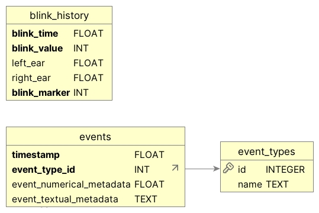

# DryEye Defender

The graphical user interface for the DryEye Defender software: detecting blinks and providing reminders to blink.

## Repos

- [This repo](https://github.com/scoville/dryeye-defender)
  - [Submodule: Backend repo](https://github.com/scoville/blink-detection)

## Code Structure

For details see [code_structure](docs/code_structure.md) but in short, we this repo contains the GUI implemented in pyside6, and creates a local sqlite3 DB for storing blink data. No personal data is shared to the internet. The module uses a submodule `blink-detection` to perform inference on webcam frames.

## How to install and run

Ensure you have `git lfs` installed: `git lfs install && git lfs pull`

### Docker

- To start via docker, simply run `docker-compose up`
- For the webcam, the docker-compose mounts a few video sockets in the hope of capturing the correct one for your machine, you may need to edit docker-compose if your webcam is not one of these devices.
- We mount the current repo so edits to code will be reflected live in the container.

### Local

Alternatively, you can run the program locally.

1. Create a venv of python3.11
    1. `python3.11 -m venv .venv`
    2. `source .venv/bin/activate`

2. Update submodules
   1. `git submodule update --init`

3. Install `requirement.txt`
    1. `python -m pip install -r requirements_linux.txt` for linux (or `requirements_mac.txt` / `requirements_windows.txt` if on Mac or Windows)
    1. for linting and ci libraries : `python -m pip install -r requirements_ci.txt`

3. Install the submodule `python -m pip install -e submodules/blink-detection`
    3. or using another solution `python -m pip install "git@github.com:scoville/blink-detection-public.gitt"`

5. Run program
   1. `python -m dryeye_defender`

### Building binaries

See the github actions scripts for details on how to build a binary for your platform.

### Database

We use a sqlite3 DB to store blink data, for which the Entity-Relationship diagram is shown below:

The `blink_history` table stores the blink data indexed by `timestamp`.

The `blink_marker` column is used to indicate whether the blink was detected by the model or by the user (0 most of the time, 1 if a blink is detected).

`blink_value` represents the eye state: it is either -1 (closed) or 1 (open)

`left_ear` and `right_ear` are floating point numbers representing the [Eye Aspect (EAR) Ratio](https://www.mdpi.com/2079-9292/11/19/3183). This is in range -1 to 1 due to normalizing via a rolling window median filter (i.e. centering EAR around 0)